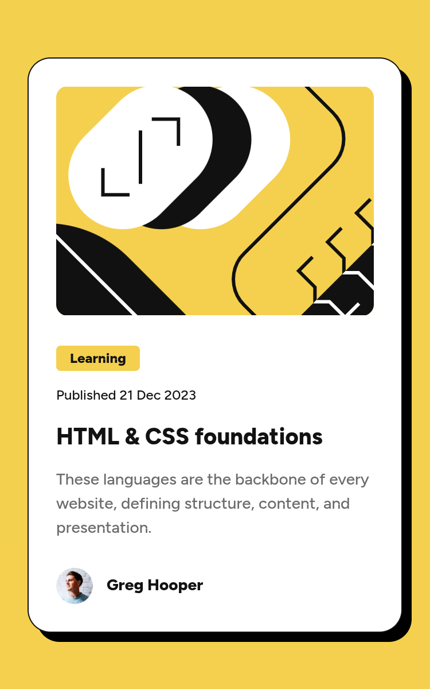

# Frontend Mentor - Blog preview card solution

This is a solution to the [Blog preview card challenge on Frontend Mentor](https://www.frontendmentor.io/challenges/blog-preview-card-ckPaj01IcS). Frontend Mentor challenges help you improve your coding skills by building realistic projects.

## Table of contents

- [Overview](#overview)
  - [The challenge](#the-challenge)
  - [Screenshot](#screenshot)
  - [Links](#links)
- [My process](#my-process)
  - [Built with](#built-with)
- [Author](#author)
- [Acknowledgments](#acknowledgments)

## Overview

### The challenge

Users should be able to:

- See hover and focus states for all interactive elements on the page

### Screenshot

### Links

- Solution URL: [https://www.frontendmentor.io/solutions/blog-preview-card-solution-bXOFS0ZQ-E](https://www.frontendmentor.io/solutions/blog-preview-card-solution-bXOFS0ZQ-E)
- Live Site URL: [https://shaunbytes.github.io/fem-blog-preview-card](https://shaunbytes.github.io/fem-blog-preview-card)

## My process

### Built with

- Semantic HTML5 markup
- CSS custom properties
- Flexbox
- Mobile-first workflow

## Author

- GitHub - [ShaunBytes](https://github.com/ShaunBytes)
- Frontend Mentor - [@ShaunBytes](https://www.frontendmentor.io/profile/ShaunBytes)
- X (fka Twitter) - [@ShaunBytes](https://x.com/ShaunBytes)

## Acknowledgments

[Frontend Mentor](https://www.frontendmentor.io)
